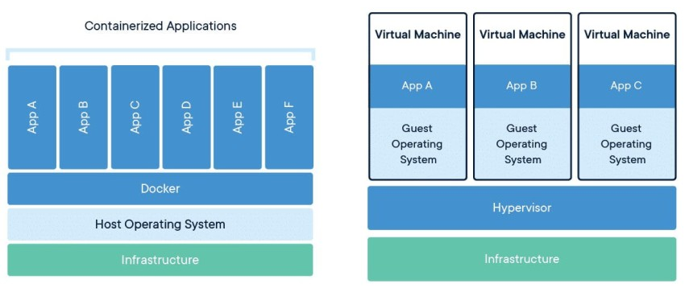
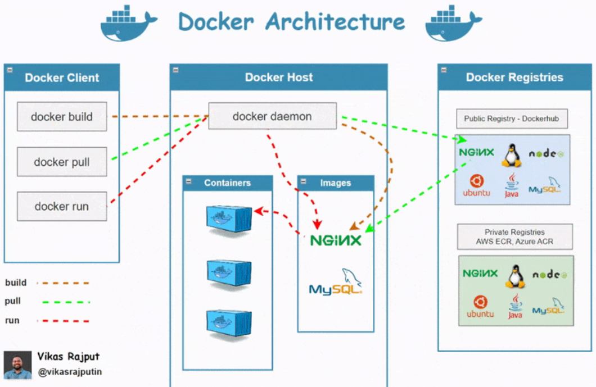

# **1.1 Container?**

Container is lightweight, standalone package that include an application and everything it needs to run, like code,libraries and dependencies.it ensures the application run the same way everywhere, whether on developer laptop, servers or cloud.

# **1.2 Containerization ?**

Containerization is the method of packaging the application and its dependencies into that container

# **1.3 What is Docker ?**

Docker is an open-source containerization platform that automates the deployment, scaling, and management of applications by packaging them into containers.

# 1.4 Difference Between Docker and Virtualization

| **Aspect** | **Virtual Machine (VM)** | **Docker Container** |
| --- | --- | --- |
| **Definition** | A virtualized environment that emulates a full OS. | A lightweight, isolated environment that shares the host OS kernel. |
| **OS** | Runs a full operating system (OS) inside it. | Shares the host OS kernel; no separate OS. |
| **Size** | Large (GBs) due to the full OS and dependencies. | Small (MBs) as it only includes the app and its dependencies. |
| **Startup Time** | Slow (minutes) because it boots a full OS. | Fast (seconds) as it uses the host OS kernel. |
| **Performance** | Lower performance due to hardware virtualization. | Near-native performance as it runs directly on the host OS. |
| **Resource Usage** | High (requires more CPU, RAM, and disk space). | Low (shares resources with the host OS). |
| **Isolation** | Strong isolation (each VM has its own OS). | Lightweight isolation (shares the host OS kernel). |
| **Portability** | Less portable due to large size and OS dependency. | Highly portable (can run on any system with Docker installed). |
| **Use Case** | Best for running multiple OSes or legacy apps. | Best for micro-services, CI/CD, and Scalable apps. |
| ****Security**** | More secure due to strong isolation. | Less secure (shares the host OS kernel, so vulnerabilities can affect the host). |

# **1.5 Docker architectureTo Attack**

****

&nbsp;

****

# 1.5 Understanding the terminology

### 1\. Dockerfile

#### Dockerfile is a file where we provide the steps to build your Docker Image.

### 2.The Docker daemon

Docker daemon is the long-running background process responsible for managing the entire lifecycle of Docker objects.

- **Image Management:** Pulling images from registries (like Docker Hub), building images from Dockerfiles, and storing them.
- **Container Management:** Creating, running, monitoring, and stopping containers.
- **Resource Management:** Managing network interfaces and volumes for containers.
- **Communication:** Can communicate with other Docker daemons to manage swarm services

# 1.6  Files and Folders in containers base images

&nbsp;   /bin: contains binary executable files, such as the ls, cp, and ps commands.

&nbsp;   /sbin: contains system binary executable files, such as the init and shutdown commands.

&nbsp;   /etc: contains configuration files for various system services.

&nbsp;   /lib: contains library files that are used by the binary executables.

&nbsp;   /usr: contains user-related files and utilities, such as applications, libraries, and documentation.

&nbsp;   /var: contains variable data, such as log files, spool files, and temporary files.

&nbsp;   /root: is the home directory of the root user.

# 1.7 Files and Folders that containers use from host operating system

&nbsp;The host's file system: Docker containers can access the host file system using bind mounts, which allow the container to read and write files in the host file system.

&nbsp;Networking stack: The host's networking stack is used to provide network connectivity to the container. Docker containers can be connected to the host's network directly or through a virtual network.

&nbsp;System calls: The host's kernel handles system calls from the container, which is how the container accesses the host's resources, such as CPU, memory, and I/O.

&nbsp;Namespaces: Docker containers use Linux namespaces to create isolated environments for the container's processes. Namespaces provide isolation for resources such as the file system, process ID, and   network.

&nbsp;Control groups (cgroups): Docker containers use cgroups to limit and control the amount of resources, such as CPU, memory, and I/O, that a container can access.