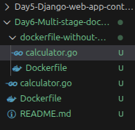

&nbsp;

# clone the project

[git clone https://github.com/RavinduRasara/Docker-Full-Course.git](https://github.com/RavinduRasara/Docker-Full-Course.git)



# Docker file (without multistage)

```bash
# BASE IMAGE

FROM ubuntu AS build

RUN apt-get update && apt-get install -y golang-go

ENV GO111MODULE=off

COPY . .

RUN CGO_ENABLED=0 go build -o /app .

ENTRYPOINT ["/app"]
```

&nbsp;

dockerfile-without-multistage\$ `ls`  
calculator.go Dockerfile

dockerfile-without-multistage\$ `docker build -t simplecal1 .`  
<span style="color: rgb(53, 152, 219);">\[+\] Building 93.0s (5/8) docker:desktop-linux</span>  
 <span style="color: rgb(53, 152, 219);">\=> \[internal\] load build definition from Dockerfile 0.1s</span>  
 <span style="color: rgb(53, 152, 219);">\=> => transferring dockerfile: 305B 0.0s</span>  
 <span style="color: rgb(53, 152, 219);">\=> \[internal\] load metadata for docker.io/library/ubuntu:latest 2.6s</span>  
 <span style="color: rgb(53, 152, 219);">\=> \[internal\] load .dockerignore 0.1s</span>  
 <span style="color: rgb(53, 152, 219);">\=> => transferring context: 2B</span>

dockerfile-without-multistage\$ `docker images`

<span style="color: rgb(53, 152, 219);">IMAGE ID DISK USAGE CONTENT SIZE EXTRA</span>  
<span style="color: rgb(53, 152, 219);">simplecal1:latest 9a3ea4619d3f 967MB 249MB</span>

**`Image size = 967MB`**

# Docker File with Multi stage and  Distroless Container base image

&nbsp;

```bash
###########################################
# BASE IMAGE (only dedicated to build stage)
###########################################

FROM ubuntu AS build

RUN apt-get update && apt-get install -y golang-go

ENV GO111MODULE=off

COPY . .

RUN CGO_ENABLED=0 go build -o /app .

############################################
# HERE STARTS THE MAGIC OF MULTI STAGE BUILD
############################################

# minimalistic distroless image(go language doesn't need go run time)
FROM scratch

# Copy the compiled binary from the build stage
COPY --from=build /app /app

# Set the entrypoint for the container to run the binary
ENTRYPOINT ["/app"]
```

&nbsp;

Day6-Multi-stage-docker-build\$ `docker build -t simplecal2 .`  
\[+\] Building 12.2s (10/10) FINISHED docker:desktop-linux  
 => \[internal\] load build definition from Dockerfile 0.1s  
 => => transferring dockerfile: 589B 0.0s  
 => \[internal\] load metadata for docker.io/library/ubuntu:latest 2.4s  
 => \[internal\] load .dockerignore 0.1s  
 => => transferring context: 2B 0.0s  
 => \[build 1/4\] FROM docker.io/library/ubuntu:latest@sha256:d1e2e92c075e5ca139d51a140fff46f84315c0fdce203e

Day6-Multi-stage-docker-build\$ `docker images`  
                                                                                                                                                                                         
IMAGE ID DISK USAGE CONTENT SIZE EXTRA  
simplecal1:latest 9a3ea4619d3f 967MB 249MB  
simplecal2:latest d4ef14d86709 3.18MB 1.21MB

## `Image size = 3.18 MB`

### <span style="color: rgb(236, 240, 241);">The main advantage we have not only reduce size of the image.it container running  securely.</span>

&nbsp;

# <span style="color: rgb(236, 240, 241);">Explanations</span>

<span style="color: rgb(45, 194, 107);">###########################################</span>  
<span style="color: rgb(45, 194, 107);">\# BASE IMAGE (only dedicated to build stage)</span>  
<span style="color: rgb(45, 194, 107);">###########################################</span>

<span style="color: rgb(224, 62, 45);">FROM ubuntu AS build</span>

<span style="color: rgb(224, 62, 45);">RUN apt-get update && apt-get install -y golang-go</span>

<span style="color: rgb(224, 62, 45);">ENV GO111MODULE=off</span>

<span style="color: rgb(224, 62, 45);">COPY . .</span>

<span style="color: rgb(224, 62, 45);">RUN CGO_ENABLED=0 go build -o /app .</span>

<span style="color: rgb(45, 194, 107);">############################################</span>  
<span style="color: rgb(45, 194, 107);">\# HERE STARTS THE MAGIC OF MULTI STAGE BUILD</span>  
<span style="color: rgb(45, 194, 107);">############################################</span>

<span style="color: rgb(224, 62, 45);">FROM scratch</span>

<span style="color: rgb(224, 62, 45);">COPY --from=build /app /app</span>

<span style="color: rgb(224, 62, 45);">ENTRYPOINT \["/app"\]</span>

&nbsp;

<span style="color: rgb(236, 240, 241);">1. `FROM ubuntu AS build`</span>

<span style="color: rgb(236, 240, 241);">`AS build` → Give this stage a **nickname** called "build" (useful later in multi-stage)</span>

<span style="color: rgb(236, 240, 241);">2\. `RUN apt-get update && apt-get install -y golang-go`</span>

&nbsp;   `ENV GO111MODULE=off`

- `RUN` → Execute a shell command **inside the container while building**
- `apt-get update` → Refresh the list of available packages
- `apt-get install -y golang-go` → Install the **Go compiler and all its tools**
    - `ENV` → Set an **environment variable** inside the container
    - `GO111MODULE=off` → Tells Go to use the old-style dependency mode (GOPATH mode)

3\. `RUN CGO_ENABLED=0 go build -o /app .`

- <span style="color: rgb(236, 240, 241);">`CGO_ENABLED=0` → Disable C bindings — produces a **pure static binary** (no external library dependencies)</span>
    - `go build` → **Compile** your Go source code
    - `-o /app` → Output the compiled binary file at path `/app`
    - `.` → Build the Go code in the current directory
    - Result: a single executable file at `/app`

4\. `ENTRYPOINT ["/app"]`

- `ENTRYPOINT` → The **command that runs when the container starts**
- `["/app"]` → Run the compiled binary `/app`

&nbsp;

```
go build  -o  /app   .
   │       │    │    │
   │       │    │    └── WHERE to find source code
   │       │    │        "." means current directory
   │       │    │
   │       │    └── WHERE to save the result
   │       │        /app = save compiled result at path /app
   │       │
   │       └── "-o" means "output to"
   │            (name and location of the result file)
   │
   └── "build" means compile/translate the code
```

### What is `/app`?

CONTAINER FILESYSTEM (like folders on your computer)

```bash
FROM ubuntu  — What's inside?
─────────────────────────────────────────────────

/bin/          ← bash(shell), ls, cp, rm, mkdir
/usr/bin/      ← apt-get(package manager), curl
               └── go/go  ← Go compiler (after install)
/usr/lib/      ← go/src/  (fmt, os, net packages)
/lib/          ← libc.so.6 (C standard library)
/etc/          ← apt/sources.list, hostname configs
/var/cache/    ← apt downloaded packages stored here
/tmp/          ← temporary files (used during go build)

Total size: ~78MB just for Ubuntu base
            + Go compiler ~170MB
            = ~250MB before even adding your app!
```

&nbsp;

&nbsp;

&nbsp;
