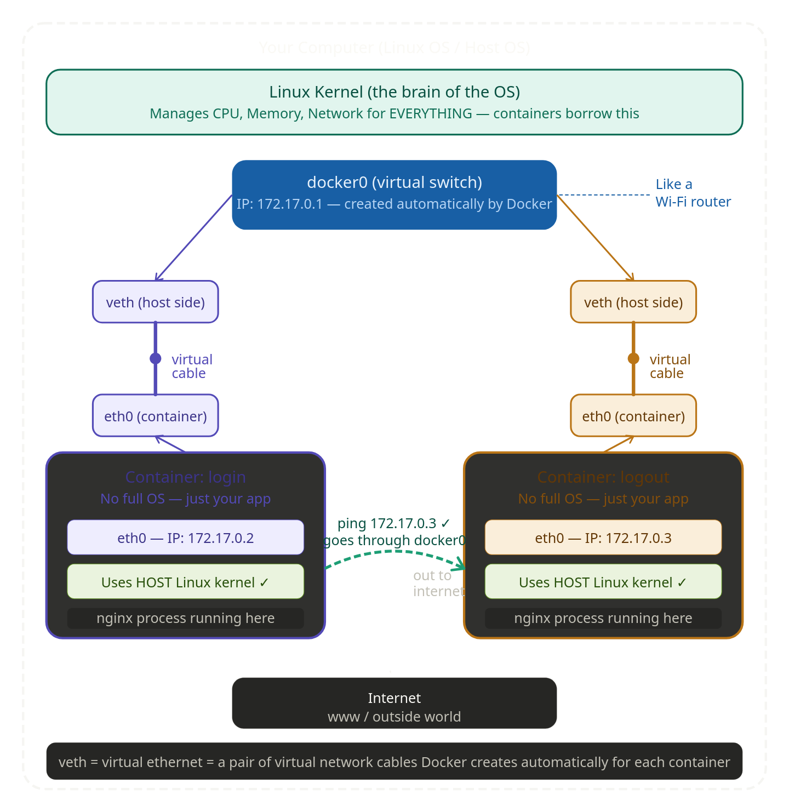
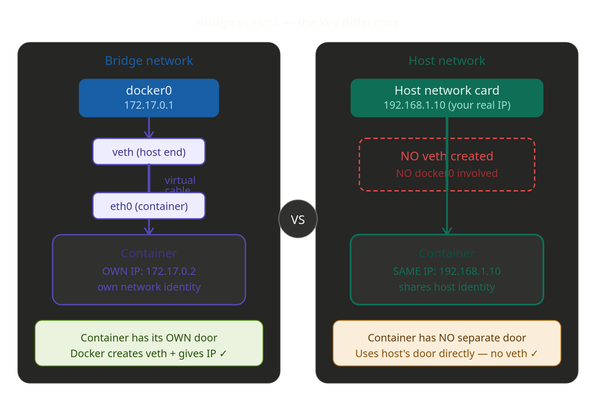
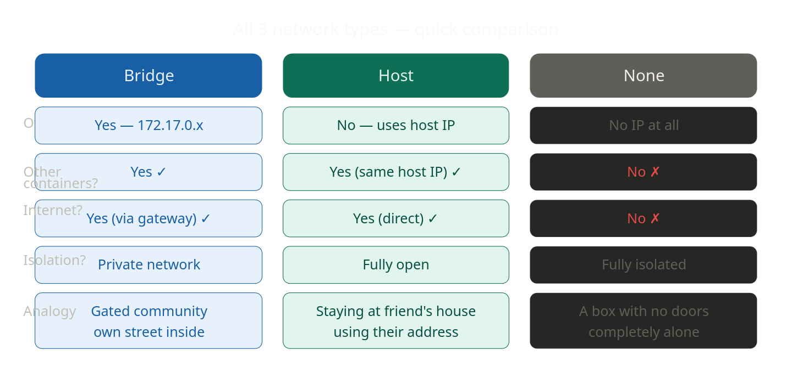

&nbsp;

**<span style="color: rgb(224, 62, 45);">1\. Docker to run the container in the background.(detached mode)</span>**

```bash
Day9-Docker-Networking$ docker run -d --name login nginx:latest
Unable to find image 'nginx:latest' locally
latest: Pulling from library/nginx
9baba07a35b6: Pull complete 
ec781dee3f47: Pull complete 
f0b77348d9b0: Pull complete 
4174e33a2c9e: Pull complete 
6b40784e4837: Pull complete 
0289d65812c3: Pull complete 
980067d12da2: Pull complete 
c96ca1f4ddf7: Download complete 
00238b7dc6b2: Download complete 
Digest: sha256:dec7a90bd0973b076832dc56933fe876bc014929e14b4ec49923951405370112
Status: Downloaded newer image for nginx:latest
5e7f0ffdb36294ff775cf59b97d86547666151c6f6ea3fec8e5592f8d35d6ae2
```

**<span style="color: rgb(224, 62, 45);">2\. Go inside the running container and give me a terminal</span>**

```bash
Day9-Docker-Networking$ docker exec -it login /bin/bash
root@5e7f0ffdb362:/# 

root@5e7f0ffdb362:/# ls
bin  boot  dev  docker-entrypoint.d  docker-entrypoint.sh  etc  home  lib  lib64  media  mnt  opt  proc  root  run  sbin  srv  sys  tmp  usr  var
```

| Part | Meaning |
| --- | --- |
| `docker exec` | Run a command inside a running container |
| `-it` | Interactive terminal |
| `login` | Container name |
| `/bin/bash` | Start the bash shell |

&nbsp;

| Part | Meaning |
| --- | --- |
| `root` | You are logged in as root user |
| `root@5e7f0ffdb362` | Container ID |
| `/` | Current directory |

```bash
root@a6d69aff7b9c:/# apt update
Get:1 http://deb.debian.org/debian trixie InRelease [140 kB]
Get:2 http://deb.debian.org/debian trixie-updates InRelease [47.3 kB]
Get:3 http://deb.debian.org/debian-security trixie-security InRelease [43.4 kB]
Get:4 http://deb.debian.org/debian trixie/main amd64 Packages [9671 kB]
Get:5 http://deb.debian.org/debian trixie-updates/main amd64 Packages [5412 B]                                                                                                                                                      
Get:6 http://deb.debian.org/debian-security trixie-security/main amd64 Packages [111 kB]                                                                                                                                            
Fetched 10.0 MB in 42s (240 kB/s)                                                                                                                                                                                                   
12 packages can be upgraded. Run 'apt list --upgradable' to see them.
```

<span style="color: rgb(224, 62, 45);">3\. `ping` is used to **test network connectivity between machines**.</span>

<span style="color: rgb(224, 62, 45);">install ping for  test network connections (communication between containers.)</span>

```bash
root@5e7f0ffdb362:/# apt-get install iputils-ping -y
Reading package lists... Done
Building dependency tree... Done
```

&nbsp;

```bash
root@5e7f0ffdb362:/# `ping -V`  
ping from iputils 20240905
root@5e7f0ffdb362:/# exit
```

<span style="color: rgb(224, 62, 45);">4\. Run another new container</span>

```bash
Day9-Docker-Networking$ docker run -d --name logout nginx:latest
ad39ee17d98fb0f331cbb5c5eb70059099e66ae7608c9d835ec3db5569fd836c
```

<span style="color: rgb(224, 62, 45);">5\. Checking running container</span>

```bash
Day9-Docker-Networking$ docker ps
CONTAINER ID   IMAGE          COMMAND                  CREATED          STATUS          PORTS     NAMES
ad39ee17d98f   nginx:latest   "/docker-entrypoint.…"   50 seconds ago   Up 49 seconds   80/tcp    logout
5e7f0ffdb362   nginx:latest   "/docker-entrypoint.…"   25 minutes ago   Up 25 minutes   80/tcp    login
```

<span style="color: rgb(224, 62, 45);">6\. To check container details  of login and logout container</span>

```bash
Day9-Docker-Networking$ docker inspect login
"bridge": {
                    "IPAMConfig": null,
                    "Links": null,
                    "Aliases": null,
                    "MacAddress": "8e:b3:8e:2a:c1:63",
                    "DriverOpts": null,
                    "GwPriority": 0,
                    "NetworkID": "89cee70eb314ee7abefd570c2bf96fb869e390fa0bb0dd16afef5270dd314e19",
                    "EndpointID": "e24beffa581a1a97fb02d651dda7885fdb6b9e15e875703d93b6e673af323d7a",
                    "Gateway": "172.17.0.1",
                    "IPAddress": "172.17.0.2",
                    "IPPrefixLen": 16,
                    "IPv6Gateway": "",
                    "GlobalIPv6Address": "",
                    "GlobalIPv6PrefixLen": 0,
                    "DNSNames": null
                }
```

"IPAddress": "172.17.0.2",

```bash
docker inspect logout
 "bridge": {
                    "IPAMConfig": null,
                    "Links": null,
                    "Aliases": null,
                    "MacAddress": "96:6a:f1:b3:38:f7",
                    "DriverOpts": null,
                    "GwPriority": 0,
                    "NetworkID": "89cee70eb314ee7abefd570c2bf96fb869e390fa0bb0dd16afef5270dd314e19",
                    "EndpointID": "e80930535bd9de465fe801b248da0a89caaf31a3ce9de474847e4a41ae1c72ff",
                    "Gateway": "172.17.0.1",
                    "IPAddress": "172.17.0.3",
                    "IPPrefixLen": 16,
                    "IPv6Gateway": "",
                    "GlobalIPv6Address": "",
                    "GlobalIPv6PrefixLen": 0,
                    "DNSNames": null
                }
```

"IPAddress": "172.17.0.3",

**<span style="color: rgb(224, 62, 45);">Both of container should be in the same subnet. because we are using default Bridge Network, both of them  should be in the same subnet.</span>**

# What is a Subnet (Simple idea)

A **subnet** is a **small network inside a bigger network**.

Think of it like this:

🏢 **Apartment building**

- Building = Network
    
- Each floor = Subnet
    
- Rooms = Devices
    

Devices on the **same floor (same subnet)** can easily talk to each other.

**<span style="color: rgb(224, 62, 45);">7\. we connect to logout container  from login container using bridge network.The ping worked</span>**

```bash
root@5e7f0ffdb362:/# ping 172.17.0.3
PING 172.17.0.3 (172.17.0.3) 56(84) bytes of data.
64 bytes from 172.17.0.3: icmp_seq=1 ttl=64 time=1.01 ms
64 bytes from 172.17.0.3: icmp_seq=2 ttl=64 time=0.121 ms
64 bytes from 172.17.0.3: icmp_seq=3 ttl=64 time=0.125 ms
```

- containers can talk to each other because they are on the **same bridge network**.
- The gateway (172.17.0.1) is like the "router" that manages this little private network inside your computer.

&nbsp;

```bash
Day9-Docker-Networking$ docker network ls
NETWORK ID     NAME      DRIVER    SCOPE
89cee70eb314   bridge    bridge    local
8121700e1bc1   host      host      local
f5907c37d3e2   none      null      local
```

**<span style="color: rgb(224, 62, 45);">8\. To create new network and remove</span>**

```bash
Day9-Docker-Networking$ docker network create test
9d8bed20a74ebdb72ebdb402207e5d4f181687d0c42d2ff76319bae48936d8d0
Day9-Docker-Networking$ docker network ls
NETWORK ID     NAME      DRIVER    SCOPE
89cee70eb314   bridge    bridge    local
8121700e1bc1   host      host      local
f5907c37d3e2   none      null      local
9d8bed20a74e   test      bridge    local

Day9-Docker-Networking$ docker network rm test
test
Day9-Docker-Networking$ docker network ls
NETWORK ID     NAME      DRIVER    SCOPE
89cee70eb314   bridge    bridge    local
8121700e1bc1   host      host      local
f5907c37d3e2   none      null      local
```

<span style="color: rgb(224, 62, 45);">**9\. Docker bridge network architecture**</span>



&nbsp;

**What is `docker0`?**

When you install Docker, it automatically creates a **virtual switch** called `docker0` inside your computer. Think of it like a **Wi-Fi router** that only exists inside your computer. Every container connects to this router. The router's address is `172.17.0.1` — that is the Gateway you saw in `docker inspect`.

**What is `veth` (virtual ethernet)?**

When Docker creates a container, it automatically creates a **pair of virtual cables** — like a pipe with two ends:

- One end lives **inside the container** — called `eth0` — and gets the IP like `172.17.0.2`
- The other end lives **on the host** — called `veth...` — and plugs into `docker0`

So the full path of data is:

Container (eth0: 172.17.0.2)  
    ↕ virtual cable (veth pair)  
docker0 switch (172.17.0.1)  
    ↕ virtual cable (veth pair)  
Container (eth0: 172.17.0.3)

<span style="color: rgb(224, 62, 45);">Now why does **host network NOT get a separate IP?**</span>

<span style="color: rgb(255, 255, 255);">****</span>

**So why does host network have NO separate IP?**

Because Docker does NOT create a `veth` pair for host network containers. There is no virtual cable, no `docker0` switch involved. The container just directly uses your computer's real network card. It is like the container doesn't even have its own door — it walks through the host's front door directly.

The `veth` (virtual ethernet) pair is how Docker "tricks" the container into thinking it has its own network card — but really it's just a virtual cable that goes through `docker0` and uses the host's real kernel underneath.

- **Bridge network** → Docker creates `veth` pairs + connects through `docker0` → container gets its own IP like `172.17.0.2`
- **Host network**    → Docker creates NO `veth`, NO `docker0` involved → container just uses your computer's real IP directly
- **None** network    → Docker creates nothing at all → container has zero network

&nbsp;



**<span style="color: rgb(224, 62, 45);">10\. Create new docker network (defaultly create bridge network)</span>**

```bash
Day9-Docker-Networking$ docker network create secure-network
b0723eca68218f1a020bf64ec309975c2eb3d0d98ddbdc56f1d3e76184f1117c

Day9-Docker-Networking$ docker network ls 
NETWORK ID     NAME             DRIVER    SCOPE
89cee70eb314   bridge           bridge    local
8121700e1bc1   host             host      local
f5907c37d3e2   none             null      local
b0723eca6821   secure-network   bridge    local
```

**<span style="color: rgb(224, 62, 45);">11\. Run new docker container with network</span>** 

```bash
Day9-Docker-Networking$ docker run -d --name finance --network=secure-network nginx:latest
c718d333f05f7fbf8dba270c73b5a04d4a8e04f7f28fb5fe6fdf5ac7fd435ef9

Day9-Docker-Networking$ docker ps
CONTAINER ID   IMAGE          COMMAND                  CREATED          STATUS          PORTS     NAMES
c718d333f05f   nginx:latest   "/docker-entrypoint.…"   24 seconds ago   Up 23 seconds   80/tcp    finance
ad39ee17d98f   nginx:latest   "/docker-entrypoint.…"   7 hours ago      Up 7 hours      80/tcp    logout
5e7f0ffdb362   nginx:latest   "/docker-entrypoint.…"   7 hours ago      Up 7 hours      80/tcp    login
```

&nbsp;

```bash
Day9-Docker-Networking$ docker inspect finance
"Networks": {
                "secure-network": {
                    "IPAMConfig": null,
                    "Links": null,
                    "Aliases": null,
                    "MacAddress": "fe:dd:20:9e:7c:66",
                    "DriverOpts": null,
                    "GwPriority": 0,
                    "NetworkID": "b0723eca68218f1a020bf64ec309975c2eb3d0d98ddbdc56f1d3e76184f1117c",
                    "EndpointID": "0af8be6dc896c96fddbe70f0658b5afa2676bd1b87671fdcf28a4315e12c6ce5",
                    "Gateway": "172.18.0.1",
                    "IPAddress": "172.18.0.2",
                    "IPPrefixLen": 16,
                    "IPv6Gateway": "",
                    "GlobalIPv6Address": "",
                    "GlobalIPv6PrefixLen": 0,
                    "DNSNames": [
                        "finance",
                        "c718d333f05f"
                    ]
```

&nbsp;

**<span style="color: rgb(224, 62, 45);">12\. Try to ping finance container form login container</span>**

```bash
Day9-Docker-Networking$ docker exec -it login /bin/bash
root@5e7f0ffdb362:/# ping 172.18.0.2
PING 172.18.0.2 (172.18.0.2) 56(84) bytes of data.

```

<span style="color: rgb(35, 111, 161);">`<span style="color: rgb(45, 194, 107);">****** we will not able to reach finance container ******</span>`</span>

- <span style="color: rgb(45, 194, 107);">\*\*  This is how secure container using concept of networking....</span>

&nbsp;

<span style="color: rgb(255, 255, 255);">But we can ping to logout container from loging container successfully.</span>

```bash
root@5e7f0ffdb362:/# ping 172.17.0.3
PING 172.17.0.3 (172.17.0.3) 56(84) bytes of data.
64 bytes from 172.17.0.3: icmp_seq=1 ttl=64 time=0.205 ms
64 bytes from 172.17.0.3: icmp_seq=2 ttl=64 time=0.058 ms
64 bytes from 172.17.0.3: icmp_seq=3 ttl=64 time=0.045 ms
64 bytes from 172.17.0.3: icmp_seq=4 ttl=64 time=0.198 ms
```

<span style="color: rgb(45, 194, 107);">logging and logout container  by default with bridge network.so they were able to communicate with each other.whereas finance container secure network it completely isolated.</span>

**<span style="color: rgb(224, 62, 45);">13\. Running container with host network.</span>**

```bash
Day9-Docker-Networking$ docker run -d --name hostdemo --network=host nginx:latest
53bc6ec3ffa301454e4177facf5c32236a1e077fdf8324c5df9b9a27b376ab92

Day9-Docker-Networking$ docker inspect hostdemo
 "Networks": {
                "host": {
                    "IPAMConfig": null,
                    "Links": null,
                    "Aliases": null,
                    "MacAddress": "",
                    "DriverOpts": null,
                    "GwPriority": 0,
                    "NetworkID": "8121700e1bc1b87406b91ed768554329b7604d192d4d1778256e3e1175b7f2e5",
                    "EndpointID": "fc440eab05e6b9f9a1a4cccc55b7f33c5c8ef35f227a85e9d111f11b8ecde37d",
                    "Gateway": "",
                    "IPAddress": "",
                    "IPPrefixLen": 0,
                    "IPv6Gateway": "",
                    "GlobalIPv6Address": "",
                    "GlobalIPv6PrefixLen": 0,
                    "DNSNames": null
                }
```

<span style="color: rgb(45, 194, 107);">There is no custom ip address here. because it binned with host networking. so docker did not create any virtual network. we are able to access this container using host.</span>

&nbsp;